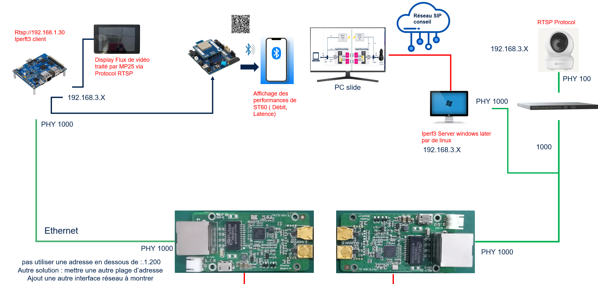

# STM32WBA Web Bluetooth® Interface

Bienvenue sur l’interface Web Bluetooth pour la carte **STM32WBA**, développée pour permettre la communication entre la carte **STM32MP25** (via UART) et un smartphone via **Bluetooth® Low Energy (BLE)**.

## Démo en ligne

Accédez directement à l’interface web :
[https://dalalameziane.github.io/WBA-web-interface/](https://dalalameziane.github.io/WBA-web-interface/)

## Objectif du projet

- Recevoir des données UART de la carte MP25
- Visualiser les données sur une interface web en temps réel
- Transmettre les données en BLE avec la carte WBA
- Afficher les performances du lien (latence, débit, etc.)

## Architecture

## Technologies utilisées

- **React 18**
- **Bootstrap 5**
- **Web Bluetooth API**
- **STM32Cube FW WBA**
- **GitHub Pages**

## Fonctionnalités

- Connexion à une carte STM32WBA via BLE
- Visualisation temps réel des données UART (MP25 → WBA → BLE)
- Interface responsive pour mobile & desktop
- QR Code pour un accès rapide via smartphone
